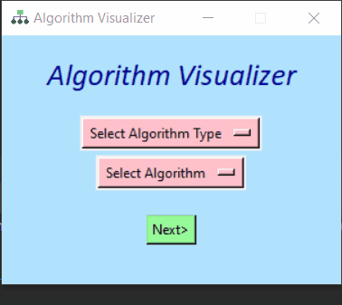

    

 

  
  <h1 align="center">Algorithm Visualizer</h1>
  

  <i><b>A desktop app made using Tkinter and Pygame modules of Python to visualize different computer algorithms like searching, sorting and backtracking e.t.c.
  The main motive of this project is to help out beginners who's trying to understand the basic idea of common algorithms. 
  More algorithms and sounds will be added in future to improve overall experience of the users and make this app more user friendly.</b></i>
  

### Algorithm Contents
* Searching Algorithms
  * Linear Search
  * Binary Search
* Sorting Algorithms
  * Selection Sort
  * Insertion Sort
  * Bubble Sort
  * Merge Sort
  * Quick Sort
  * Heap Sort
  * Shell Sort
  * Radix Sort
* Backtracking Algorithms
  * Sudoku
  * N-Queens
  * Knight's Tour

### Main Window
The main window has two dropdown menus to select the Algorithm Type and Name which the user wants to visualize. By default, the Algorithm Name menu is set to None, but if an Algorithm Type is selected it will get automatically updated with the different algorithms of that type. The next button will take you to a new window depending on the algorithm selected. For exit, it will show a warning message to check if you really want to exit or not. Below a gif is shown demonstrating the main window.

