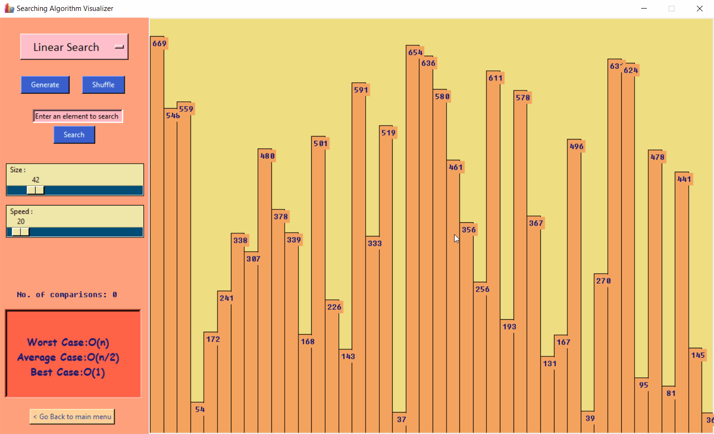
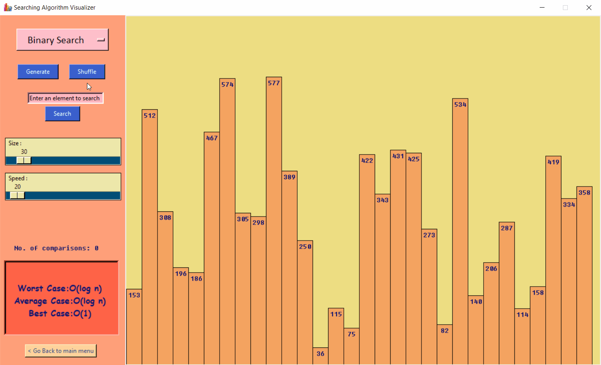
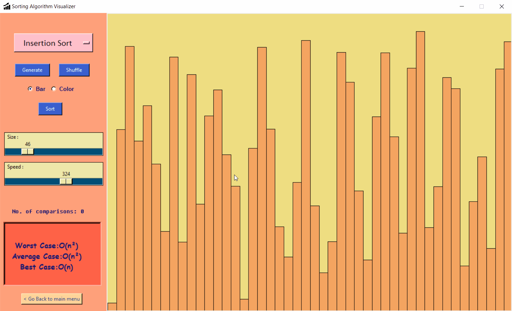
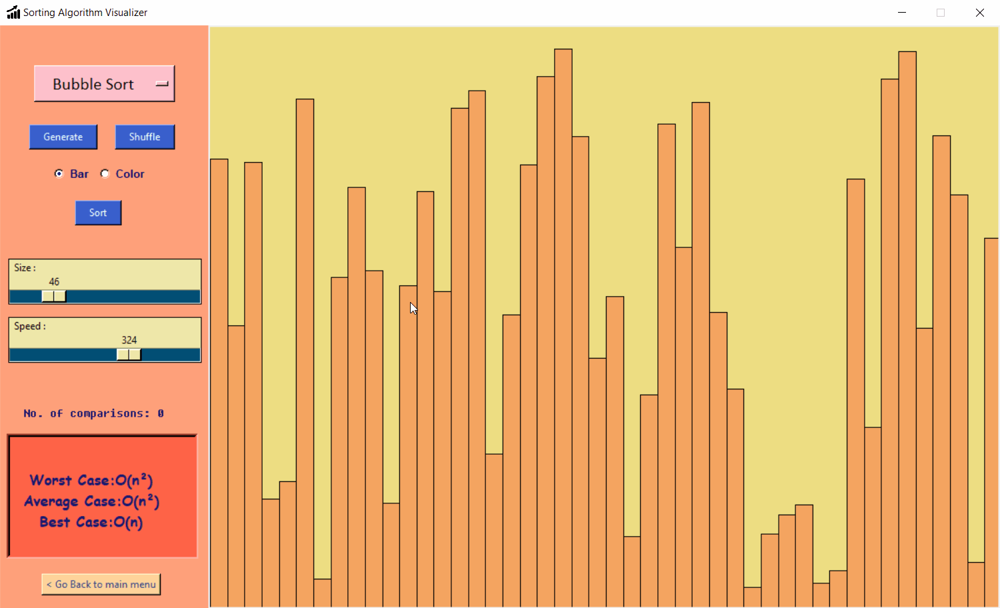
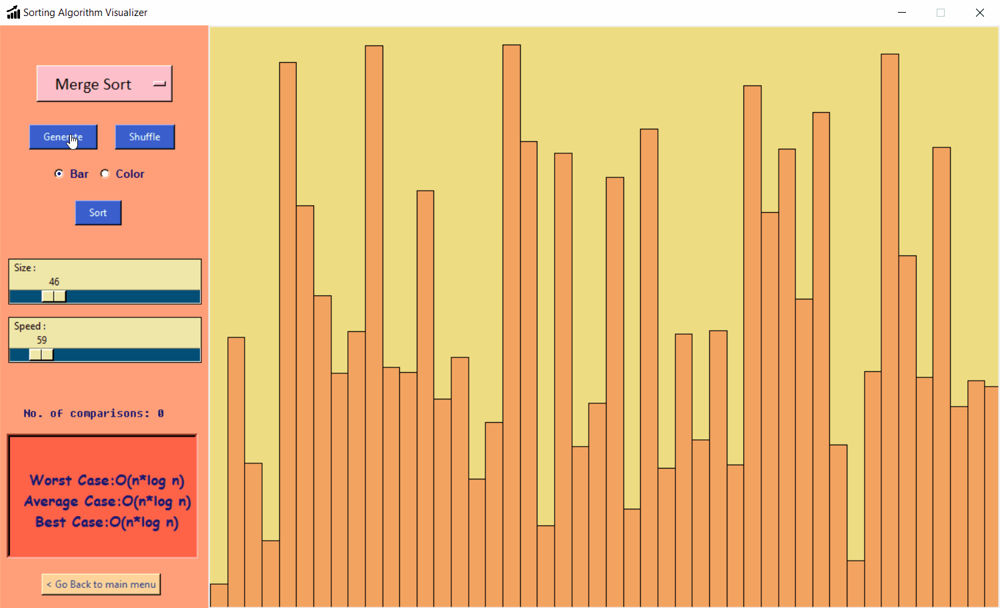
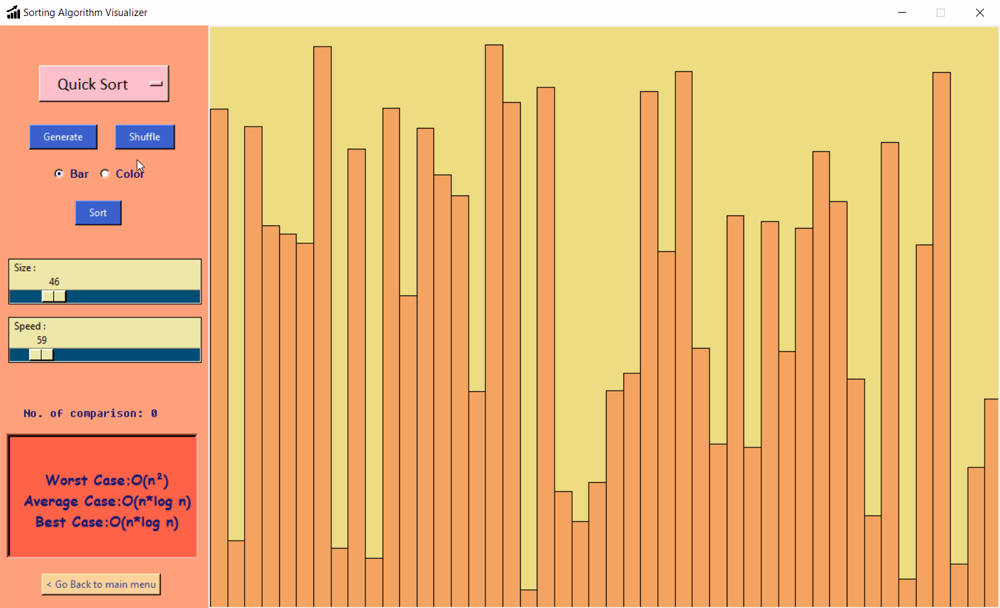
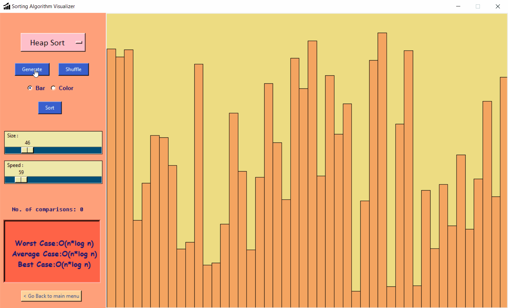
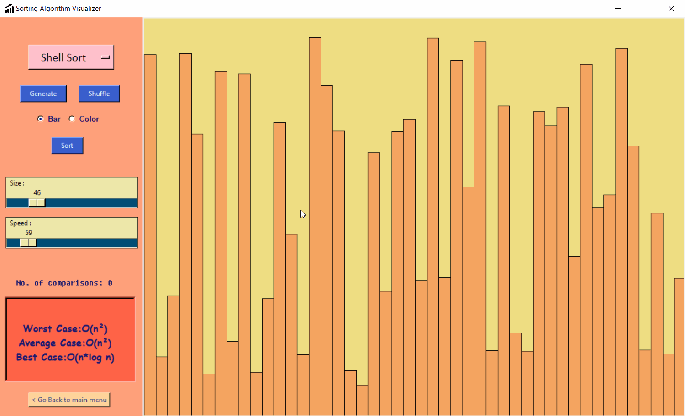
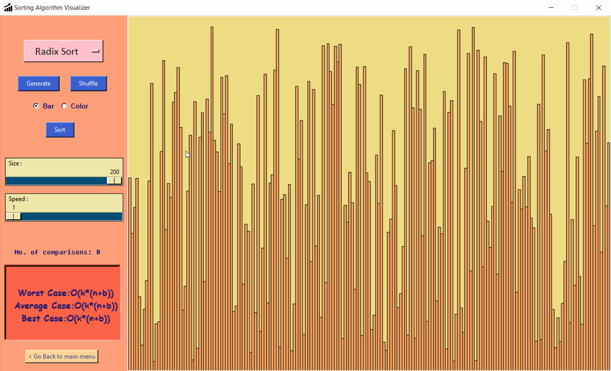

    

 

  
  <h1 align="center">Algorithm Visualizer</h1>
  

  <i><b>A desktop app made using Tkinter and Pygame modules of Python to visualize different computer algorithms like searching, sorting and backtracking e.t.c.
  The main motive of this project is to help out beginners who's trying to understand the basic idea of common algorithms.  
  More algorithms and sounds will be added in future to improve overall experience of the users and make this app more user friendly. 
    Any contributions to make this project better is welcome.</b></i>
  

### Algorithm Contents
* Searching Algorithms
  * Linear Search
  * Binary Search
* Sorting Algorithms
  * Selection Sort
  * Insertion Sort
  * Bubble Sort
  * Merge Sort
  * Quick Sort
  * Heap Sort
  * Shell Sort
  * Radix Sort
* Backtracking Algorithms
  * Sudoku
  * N-Queens
  * Knight's Tour

### Main Window
The main window has two dropdown menus to select the Algorithm Type and Name which the user wants to visualize. By default, the Algorithm Name menu is set to None, but if an Algorithm Type is selected it will get automatically updated with the different algorithms of that type. The next button will take you to a new window depending on the algorithm selected. For exit, it will show a warning message to check if you really want to exit or not. Below a gif is shown demonstrating the main window.

### Searching Algorithms
The Searching Algorithm Visualizer window again has the option to change the searching algorithm according to user needs (i.e. no need to go to the main window to change). Option to generate and shuffle the array is provided. A blank text box is given to enter the value of element user wants to search. The search button starts the searching operation. There's a label for showing number of comparisons and where the element is found after searching is done. Also an algorithm info section is given which will give necessary time complexity details of the searching algorithm. Button for going back to the main menu is also given. The searching is done on bar graphs with already checked elements marked with red and the searched element (if found) with green.
#### &nbsp;&nbsp;&nbsp;&nbsp;Linear Search
&nbsp;&nbsp;&nbsp;&nbsp; 
#### &nbsp;&nbsp;&nbsp;&nbsp;Binary Search
&nbsp;&nbsp;&nbsp;&nbsp; 

### Sorting Algorithms
The Sorting Algorithm Visualizer window again has the option to change the searching algorithm according to user needs (i.e. no need to go to the main window to change). Option to generate and shuffle the array is provided. __Two options are given to choose the type of visualization user wants to see. One using bar graph and other is colour bars.__ The sort button starts the sorting operation. There's a label for showing number of comparisons done after each operation. Also an algorithm info section is given which will give necessary time complexity details of the sorting algorithm. Button for going back to the main menu is also given. Once the sorting is done the entire array (bars) is painted green.
#### &nbsp;&nbsp;&nbsp;&nbsp;Sorting Algorithm Visualizer Interface
&nbsp;&nbsp;&nbsp;&nbsp; 
#### &nbsp;&nbsp;&nbsp;&nbsp;Selection Sort
&nbsp;&nbsp;&nbsp;&nbsp; 
#### &nbsp;&nbsp;&nbsp;&nbsp;Insertion Sort
&nbsp;&nbsp;&nbsp;&nbsp; 
#### &nbsp;&nbsp;&nbsp;&nbsp;Bubble Sort
&nbsp;&nbsp;&nbsp;&nbsp; 
#### &nbsp;&nbsp;&nbsp;&nbsp;Merge Sort
&nbsp;&nbsp;&nbsp;&nbsp; 
#### &nbsp;&nbsp;&nbsp;&nbsp;Quick Sort
&nbsp;&nbsp;&nbsp;&nbsp; 
#### &nbsp;&nbsp;&nbsp;&nbsp;Heap Sort
&nbsp;&nbsp;&nbsp;&nbsp; 
#### &nbsp;&nbsp;&nbsp;&nbsp;Shell Sort
&nbsp;&nbsp;&nbsp;&nbsp; 
#### &nbsp;&nbsp;&nbsp;&nbsp;Radix Sort
&nbsp;&nbsp;&nbsp;&nbsp; 
